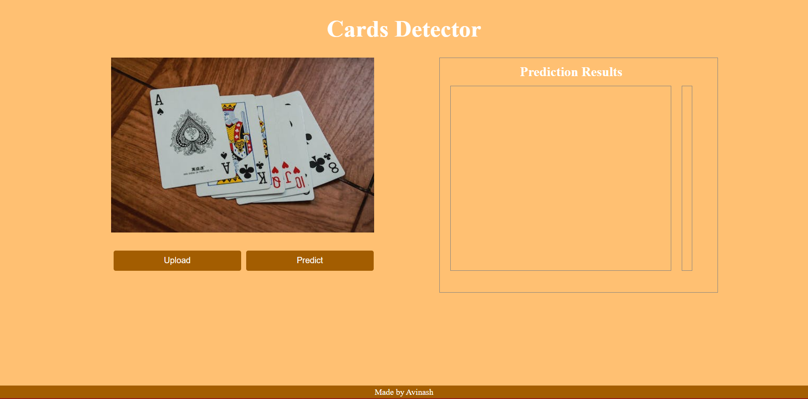
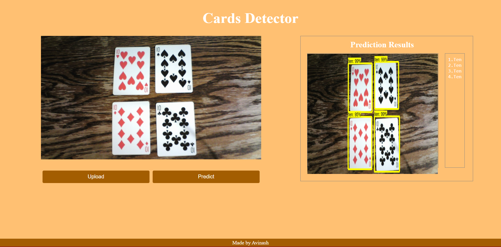

## Cards_detector_using_tfod1

This is an object detection project which uses tensorflow 1.x to detect the 

This web application detects the following cards:
* King
* Jack
* Queen
* Ace
* Nine
* Ten

Check out the web application at: 

If the above link doesn't work then follow the steps below to run this application on your local machine:

1. Create a python environment 
   ```bash
   conda create -n environment_name python=python_version -y
   ``` 
2. Activate the environment
   ```bash
   conda activate environment_name
   ```
3. Clone the github repository
    ```bash
    git clone https://github.com/Avinash905/Cards_detector_using_tfod1.git
    ```
4. Install the dependencies
   ```bash
    pip install -r requirements.txt
    ```
5. Run the application
    ```bash
    python clientApp.py
    ```

Preview of the web application: 

